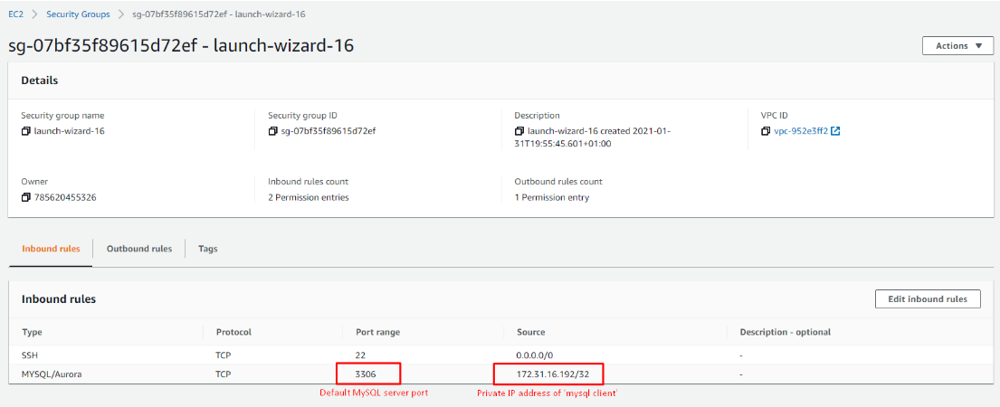
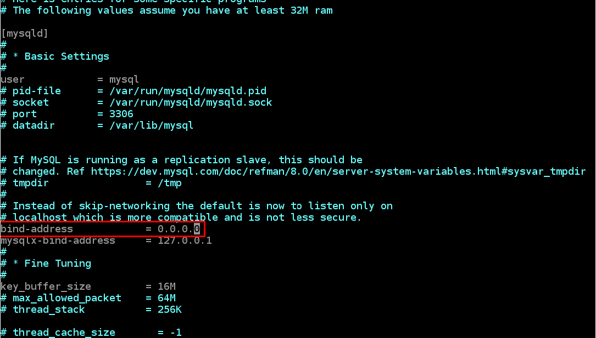
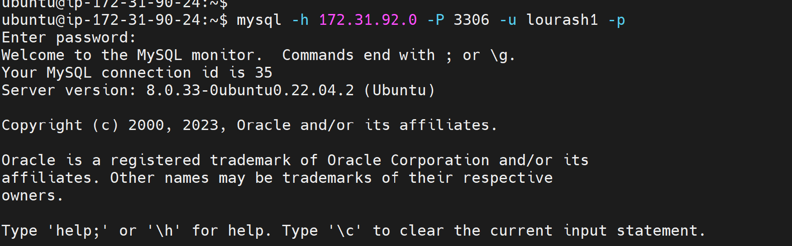
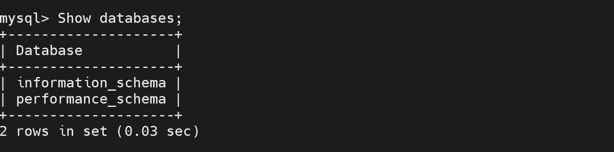

# C-Users-lourash-Documents-Lourash-Workspace-Project-5

### TASK – Implement a Client Server Architecture using MySQL Database Management System (DBMS).

1.  Create and configure two Linux-based virtual servers (EC2 instances in AWS).

  ```markdown
   Server A name - `mysql server`
   Server B name - `mysql client`
```

 run sudo apt update on both servers
```markdown
  sudo apt update
```
2.  On mysql server Linux Server install MySQL Server software.
```markdown
    sudo apt install mysql-server
```
log in to the MySQL console by typing:
```markdown
$ sudo mysql
```
This will connect to the MySQL server as the administrative database user root, which is inferred by the use of sudo when running this command. You should see output like this:

```markdown
Welcome to the MySQL monitor.  Commands end with ; or \g.
Your MySQL connection id is 11
Server version: 8.0.22-0ubuntu0.20.04.3 (Ubuntu)

Copyright (c) 2000, 2020, Oracle and/or its affiliates. All rights reserved.

Oracle is a registered trademark of Oracle Corporation and/or its
affiliates. Other names may be trademarks of their respective
owners.

Type 'help;' or '\h' for help. Type '\c' to clear the current input statement.

mysql>
```

It’s recommended that you run a security script that comes pre-installed with MySQL. This script will remove some insecure default settings and lock down access to your database system. Before running the script you will set a password for the root user, using mysql_native_password as default authentication method. We’re defining this user’s password as PassWord.1.
```markdown
ALTER USER 'root'@'localhost' IDENTIFIED WITH mysql_native_password BY 'PassWord.1';
```


3.  On mysql client Linux Server install MySQL Client software.

```markdown
    sudo apt install mysql-client
```

4.  By default, both of the EC2 virtual servers are located in the same local virtual network, so they can communicate to each other using local IP addresses. Use mysql server's local IP address to connect from mysql client. MySQL server uses TCP port 3306 by default, so you will have to open it by creating a new entry in ‘Inbound rules’ in ‘mysql server’ Security Groups. For extra security, do not allow all IP addresses to reach your ‘mysql server’ – allow access only to the specific local IP address of your ‘mysql client’.



5.  Run command below to configure MySQL server to allow connections from remote hosts.
   ```markdown
sudo vi /etc/mysql/mysql.conf.d/mysqld.cnf
```
Replace ‘127.0.0.1’ to ‘0.0.0.0’ like this:


Create user on MYSQL Server for remote user
```markdown
Create user 'lourash1'@'%' identified  with mysql_native_password by 'password';
```
6.From mysql client Linux Server connect remotely to mysql server Database Engine without using SSH. You must use the mysql utility to perform this action.

7.connect to MYSQLSERVER from MYSQLCLIENT using the commnand below
```markdown
mysql -h 172.31.92.0 -P 3306 -u lourash1 -p
```



Confirmation that the database connection is successful can be done by running the query below
```markdown
Show databases;
```


